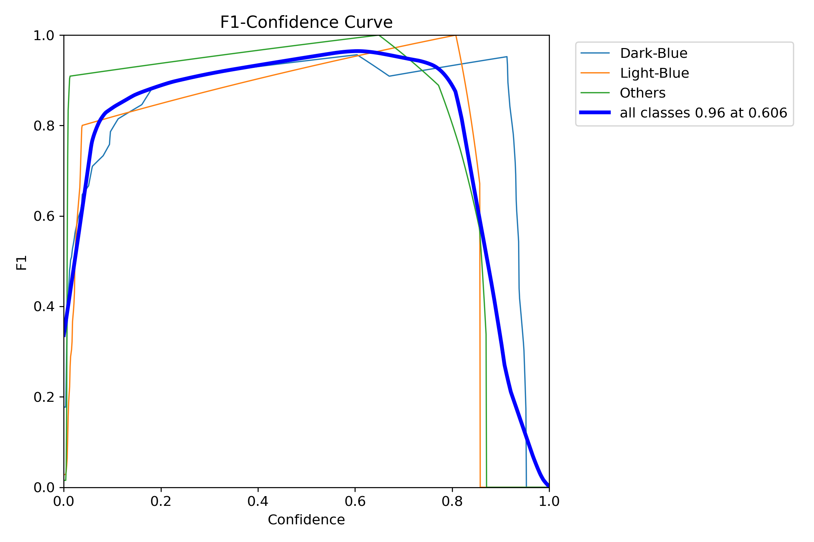
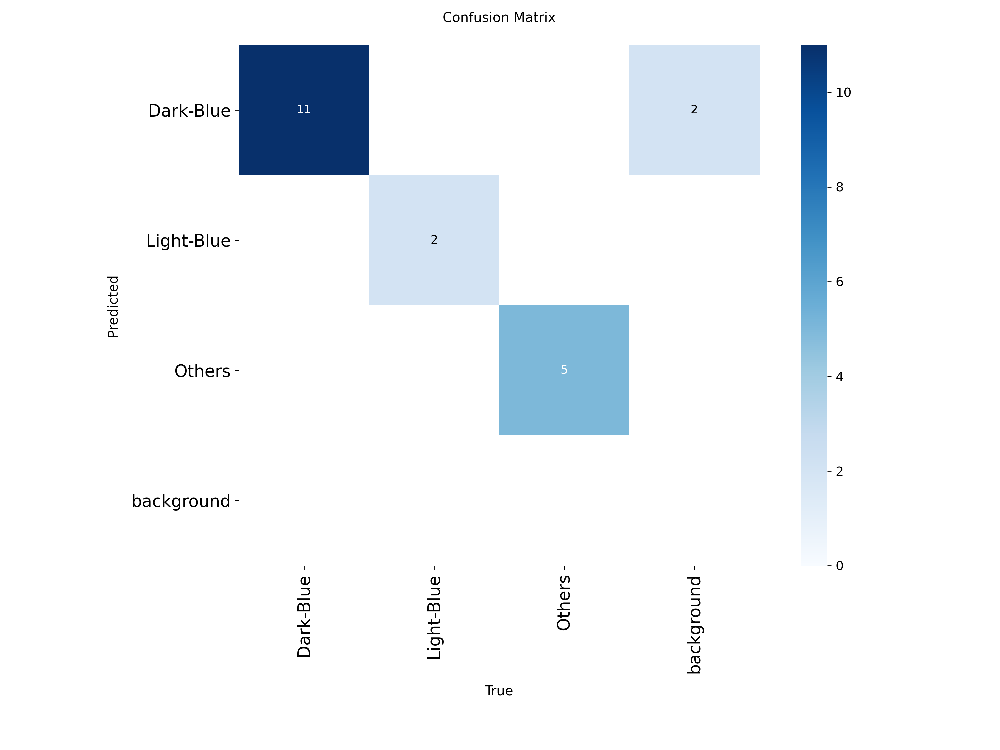
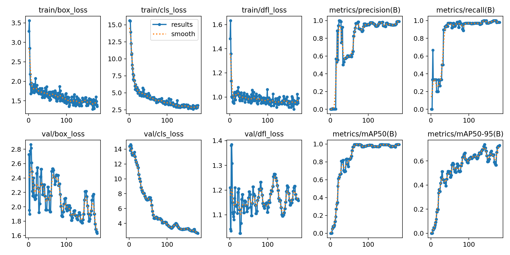
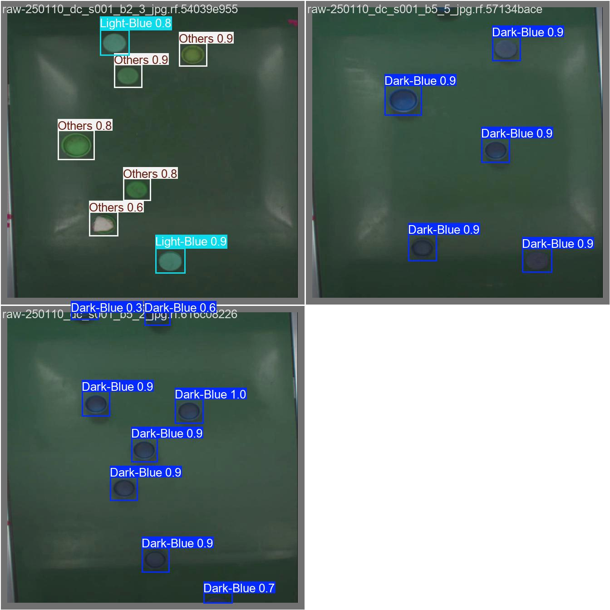

# Bottle Cap Color Detector - Industrial Sorting Pipeline

**Bottle Cap Color Detector** is an object detection project I developed to classify beverage bottle caps in industrial environments. This repository contains the complete ML pipeline, from data preprocessing to model benchmarking, comparing the latest **YOLOv12** and **YOLOv11** architectures.

---

## 1. 🛠️ Data Preprocessing & Augmentation

The dataset is managed using **Roboflow** to ensure consistency and robustness.

* **Total Images:** 30 (Split: 27 Train, 3 Valid, 0 Test)
* **Image Size:** 640x640 px
* **Format:** Auto-Orient applied

### Preprocessing Steps
To standardize inputs for the model:
1. **Auto-Orient:** Correct EXIF orientation automatically.
2. **Resize:** Stretch images to **640x640** pixels.

### Augmentations (Training Set)
Applied to create a robust model capable of handling industrial variations. **Outputs per training example: 3x**.
* **Flip:** Horizontal.
* **Rotation:** Clockwise & Counter-Clockwise (between -15° and +15°).

---

## 2. ⚙️ Training Configuration

I trained the models on **NVIDIA GeForce RTX 5090** with the following settings:

| Hyperparameter         | Value                       | Description |
|-----------------------|-----------------------------|-------------|
| Epochs                | 250                         | Total training epochs |
| Batch Size            | 8                           | Number of images per batch |
| Image Size            | 640                         | Input image resolution |
| Optimizer             | AdamW                       | Optimizer used for gradient updates |
| Initial Learning Rate | 0.001                       | Starting learning rate |
| Momentum              | 0.937                       | Momentum factor for optimizer |
| Weight Decay          | 0.0005                      | Regularization to prevent overfitting |
| Warmup Epochs         | 5                           | Gradually increasing learning rate at start |

### Augmentation Parameters

| Parameter     | Value  | Description |
|---------------|--------|-------------|
| HSV Hue Gain  | 0.01   | Adjustment to color hue |
| HSV Saturation| 0.4    | Adjustment to color saturation |
| HSV Value     | 0.3    | Adjustment to brightness/value |
| Rotation      | 8°     | Random rotation applied |
| Translation   | 0.1    | Horizontal/vertical shift |
| Scale         | 0.6    | Zoom in/out scaling |
| Shear         | 2°     | Shearing transformation |
| Mosaic        | 1.0    | Mosaic augmentation probability |
| Mixup         | 0.1    | Mixup augmentation probability |
| Copy-Paste    | 0.15   | Copy-paste augmentation probability |

> This table replaces the previous YAML configuration for clarity and easier reading.

---

## 3. 📊 Model Benchmark & Evaluation

I evaluated **6 different models** (YOLOv11 & YOLOv12 in Nano, Small, and Medium sizes).  

**Hardware:** NVIDIA GeForce RTX 5090  

### 🏆 Best Model Selection: YOLOv12 Nano

The **YOLOv12n** was selected as the best performing model.  
It achieved the **highest mAP@50-95 (74.4%)** and near-perfect **Recall (99.9%)**, making it the most reliable choice for sorting tasks where missing a bottle cap is critical.

---

### Performance Comparison Table

| Model      | Precision | Recall | mAP@50 | mAP@50-95 | Runtime | Tracked Hours | Performance Status |
|------------|-----------|--------|--------|------------|---------|---------------|------------------|
| YOLOv12n   | 0.939     | 0.999  | 0.993  | 0.744      | 2m 47s  | 2m 45s        | 🟢 BEST MODEL    |
| YOLOv12s   | 0.965     | 0.965  | 0.995  | 0.679      | 2m 3s   | 2m            | 🟡 Balanced      |
| YOLOv12m   | 0.681     | 0.970  | 0.975  | 0.659      | 2m 11s  | 2m 10s        | 🔴 Low Precision |
| YOLOv11n   | 0.967     | 0.995  | 0.995  | 0.618      | 1m 34s  | 1m 32s        | ⚡ Fastest       |
| YOLOv11s   | 0.964     | 0.973  | 0.995  | 0.672      | 1m 49s  | 1m 47s        | 🟡 Balanced      |
| YOLOv11m   | 0.940     | 0.852  | 0.995  | 0.666      | 2m 14s  | 2m 12s        | 🟡 Balanced      |

> **Note on Speed:**  
> While YOLOv11n is the fastest (1m 34s runtime), YOLOv12n offers significantly better detection quality (**mAP +12%**) with runtime 2m 47s, which is still suitable for real-time industrial sorting.

---

## 4. 📈 Key Findings

- **Architecture Superiority:** YOLOv12 outperforms YOLOv11 significantly in complex metrics (mAP50-95), proving its architecture extracts features better for this specific dataset.  
- **Recall Priority:** In industrial sorting, "Recall" is crucial (I don't want to miss-sort a bottle cap). YOLOv12n achieved **0.999 Recall**, meaning it missed almost zero objects.  
- **Stability:** The Nano model of v12 proved to be more stable than the Medium model on this dataset size, likely due to the Medium model overfitting on the small dataset (30 images).

---

## 5. Evaluation Best Model YOLOV12N

### F1 Curve

Near-Perfect Performance: The model achieves a peak F1-Score of 0.96. This is an exceptionally high score, indicating that the model excels at balancing Precision (accuracy of predictions) and Recall (ability to find all objects). It produces almost zero false alarms and misses very few targets.

Optimal Confidence Threshold: The best performance is observed at a Confidence Threshold of 0.606.

Actionable Insight: For deployment (inference), it is recommended to set the confidence filter to 0.60. This is the "sweet spot" where the model operates at maximum efficiency.

Detection Stability (Robustness): The curve remains flat and high across the 0.2 to 0.8 confidence range. This demonstrates high stability; the model is confident in its predictions and performs consistently even if lighting conditions or object positions vary slightly.

Class Dominance: The curves for Dark-Blue and Light-Blue maintain high scores for longer than other classes. This proves the model is highly effective at distinguishing between subtle blue color nuances (the core feature of this project) compared to the Others category.

### Confusion Matrices
Normalized:

Original:

### Results

### Sample Prediction

## 👤 Author

Reyga Ferdiansyah

